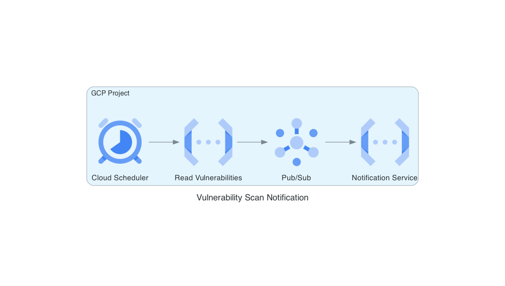

# gcp_vuln_scan
Obtains vulnerabilities from image scans and publishes them to a notification service.




**NOTE:** You must have a GCP project that contains an artifact repository with at least one
Docker image.

**NOTE:** This code does not initiate a scan for vulnerabilites but obtains the results from
a scan that was already performed.


## GCP API Services
Enable the following API services:

artifactregistry.googleapis.com    
cloudbuild.googleapis.com    
run.googleapis.com    
logging.googleapis.com   

### Using `gcloud`
```bash
gcloud services enable artifactregistry.googleapis.com \
      cloudbuild.googleapis.com \
      run.googleapis.com \
      logging.googleapis.com
```

## Run locally

1. Create a virtual env
    - `python3 -m venv venv`
2. Start virtual env
    - `. venv/bin/activate`
3. Install packages
    - `pip install -r requirements.txt`
4. Install and run PubSub emulator:
    - ref: [Testing apps locally with an emulator](https://cloud.google.com/pubsub/docs/emulator)

## Testing Pub/Sub Locally

[This page](https://cloud.google.com/pubsub/docs/emulator#env) describes the steps to test Pub/Sub locally using
the Pub/Sub emulator.  However, it took me several attempts to get everything working correctly.  The following
are the steps I took to test that `main.py/publish_scan_results(scan_results_dict)` was working correctly.

Four (4) terminal tabs will be needed for testing

Export the following environment variables in all 4 terminals:    
- `export PROJECT_ID=my-project-id`
- `export PUBSUB_PROJECT_ID=my-project-id` (yes, it is identical so I can copy and paste commands from [here](https://cloud.google.com/pubsub/docs/emulator#env))
- `export TOPIC_ID=my-topic-id`
- `export SUBSCRIPTION_ID=my-sub-id`
- Or, execute a script file containing the exports `. pubsub_test/exports.sh`

Terminal 1 (run the pubsub emulator):
  - run `. pubsub_test/exports.sh`
  - run the command `gcloud beta emulators pubsub start --project=$PROJECT_ID`
  - the command should not return to CLI prompt nor throw any errors.  If errors are thrown, fix and redo the steps

Terminal 2 (run functions-framework):
- export the PUBSUB_EMULATOR_HOST from Terminal 1 above
- Run the command: `gcloud beta emulators pubsub env-init`
  - copy the results `export PUBSUB_EMULATOR_HOST=localhost:SOME_PORT_NUMBER` and run it in the terminal 
- run the command:  `functions-framework --target scan --debug`
- the command should not return to CLI prompt nor throw any errors.  If errors are thrown, fix and redo the steps

Terminal 3 (receive subscriptions):
- Run the command: `gcloud beta emulators pubsub env-init`
  - copy the results `export PUBSUB_EMULATOR_HOST=localhost:SOME_PORT_NUMBER`
- execute `python pubsub_test/publisher.py $PUBSUB_PROJECT_ID create $TOPIC_ID`
- create a pull subscription: `python pubsub_test/subscriber.py $PUBSUB_PROJECT_ID create $TOPIC_ID $SUBSCRIPTION_ID`
- execute `python pubsub_test/subscriber.py $PUBSUB_PROJECT_ID receive $SUBSCRIPTION_ID`
- Response should be similar to `Listening for messages on projects/PUBSUB_PROJECT_ID/subscriptions/SUBSCRIPTION_ID`
  and waiting to receive a message

Terminal 4:
- Execute `curl localhost:8080`
  - The port number should match what the `functions-framework` is serving to
- Go back to Terminal 3 and a message should have been received
  
## Deploy via `gcloud`
```bash
gcloud run deploy FUNCTION \
       --source . \
       --function FUNCTION_ENTRYPOINT \
       --base-image BASE_IMAGE \
       --region REGION
```

## Grafeas Documentation
[Python Client for Grafeas](https://googleapis.dev/python/grafeas/latest/)

## Sample return value

```txt
{'PROJECT_ID': {'IMAGE_NAME': {'med': [{'affected_package': 'org.apache.tomcat.embed:tomcat-embed-core',
     'affected_version': '10.1.40',
     'fixed_package': 'org.apache.tomcat.embed:tomcat-embed-core',
     'fixed_version': '11.0.0',
     'cve_description': 'CVE-2024-52317',
     'package_type': 'MAVEN'}],
   'high': [{'affected_package': 'sqlite',
     'affected_version': '3.48.0-r0',
     'fixed_package': 'sqlite',
     'fixed_version': '3.48.0-r1',
     'cve_description': 'CVE-2025-29087',
     'package_type': 'OS'},
    {'affected_package': 'binutils',
     'affected_version': '2.43.1-r1',
     'fixed_package': 'binutils',
     'fixed_version': '2.43.1-r2',
     'cve_description': 'CVE-2025-0840',
     'package_type': 'OS'}],
   'critical': []}}}
```

## REFERENCES
[1] [Schedule an event-driven Cloud Run function](https://cloud.google.com/scheduler/docs/tut-gcf-pub-sub)

[2] [Diagrams](https://diagrams.mingrammer.com/)